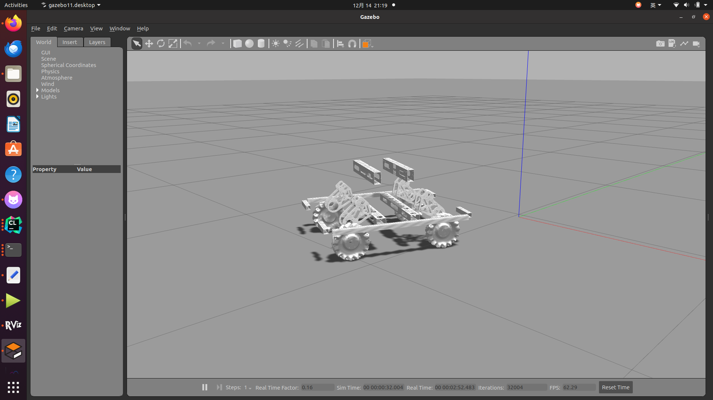

# hero_chassis_controller  
## 简介

hero_chassis_controller 是一个 ROS 控制器功能包，用于实现麦克纳姆轮机器人底盘的运动控制。它支持接受 /cmd_vel 指令，并通过逆运动学计算轮子期望转速，同时基于正运动学实现里程计发布。可以用键盘控制机器人运动。
## 功能特点

    支持麦克纳姆轮的底盘运动控制：
        根据 /cmd_vel 的 geometry_msgs/Twist 指令，计算各轮子的目标速度。
        支持全向运动，包括直行、横向移动、旋转等。

    正运动学实现里程计：
        根据各轮子的实际速度计算底盘速度和位置。
        发布 nav_msgs/Odometry 消息到 /odom 话题。
        提供 odom -> base_link 的 TF 坐标变换。

    可配置的底盘参数：
        支持通过配置文件设定轴距、轮距和轮子半径。
        支持 PID 参数调整。

    可使用键盘控制运动。


## 运行环境

    ROS 版本：Noetic
    Gazebo 版本：Gazebo 11
    操作系统：Ubuntu 20.04

## 安装与构建
### 1. 克隆代码仓库

将 hero_chassis_controller 功能包克隆到工作空间 src 目录下：
```
cd ~/catkin_ws/src
git clone https://github.com/xyx-enwei/hero_chassis_controller.git
```
### 2. 安装依赖

确保安装了功能包所需的依赖：
```
sudo apt update
sudo apt install ros-noetic-ros-control ros-noetic-ros-controllers ros-noetic-gazebo-ros-control ros-noetic-tf
sudo apt install ros-noetic-teleop-twist-keyboard
sudo apt install ros-noetic-plotjuggler
sudo apt install ros-noetic-rqt-reconfigure
sudo apt install ros-noetic-rqt-publisher
```
### 3. 编译功能包

返回工作空间根目录，编译功能包：
```
cd ~/catkin_ws
catkin build
source devel/setup.bash
```
## 使用方法
### 1. 启动 Gazebo 仿真

运行以下命令启动 Gazebo 仿真和控制器：
```
roslaunch hero_chassis_controller hero_chassis_controller.launch
```
### 2. 发布底盘速度指令

通过以下命令发送 /cmd_vel 指令控制机器人移动：

```
rostopic pub /cmd_vel geometry_msgs/Twist "
linear:
x: 0.5
y: 0.2
z: 0.0
angular:
x: 0.0
y: 0.0
z: 0.1" -r 10
```
此指令将控制机器人以 0.5 m/s 的速度前进，同时以 0.1 rad/s 的速度逆时针旋转。
### 3. 使用键盘控制机器人

功能包已经集成了 teleop_twist_keyboard 节点，可以通过键盘控制机器人移动。

运行 hero_chassis_controller.launch 文件后，终端会显示键盘控制说明，
### 4. 可视化里程计和轨迹

启动 RViz，添加以下显示内容：

    TF：显示 odom -> base_link 的坐标变换。
    Odometry：可视化 /odom 消息中的里程计轨迹。

运行 RViz：
```
rviz
```
### 5.  使用 rqt_publisher 调节底盘速度
```
rosrun rqt_publisher rqt_publisher
```
### 6. 使用 rqt_reconfigure 和PlotJuggler调整 PID 参数
```
rosrun rqt_reconfigure rqt_reconfigure
rosrun plotjuggler plotjuggler
```


## 配置说明

功能包通过 hero_chassis_controller.yaml 文件配置底盘参数和 PID 控制参数。

配置文件路径：
```
config/hero_chassis_controller.yaml
```

## 测试说明
### 1. 直线运动测试

运行以下指令：
```
rostopic pub /cmd_vel geometry_msgs/Twist "linear:
x: 1.0
y: 0.0
z: 0.0
angular:
x: 0.0
y: 0.0
z: 0.0" -r 10
```
观察机器人是否沿 X 轴直线前进。
### 2. 旋转运动测试

运行以下指令：
```
rostopic pub /cmd_vel geometry_msgs/Twist "linear:
x: 0.0
y: 0.0
z: 0.0
angular:
x: 0.0
y: 0.0
z: 1.0" -r 10
```
观察机器人是否绕自身中心逆时针旋转。  
### 3. 使用键盘控制机器人

功能包已经集成了 teleop_twist_keyboard 节点，可以通过键盘控制机器人移动。

运行 hero_chassis_controller.launch 文件后，终端会显示键盘控制说明，例如：
```
Reading from the keyboard  and Publishing to Twist!
---------------------------
Moving around:
   u    i    o
   j    k    l
   m    ,    .

For Holonomic mode (strafing), hold down the shift key:
---------------------------
   U    I    O
   J    K    L
   M    <    >

t : up (+z)
b : down (-z)

anything else : stop

q/z : increase/decrease max speeds by 10%
w/x : increase/decrease only linear speed by 10%
e/c : increase/decrease only angular speed by 10%
```
你可以在启动仿真后直接通过键盘控制机器人。  
